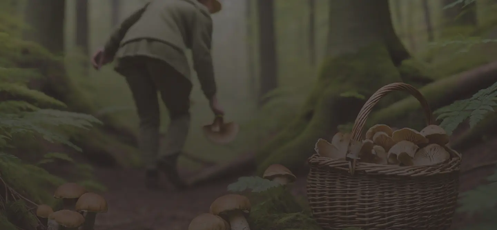

# Fungi Finders

Fungi Finders is a web-based application designed to introduce users to the world of mushroom foraging. It provides educational resources, a mushroom guide, and interactive features to help users learn about identifying and collecting mushrooms safely.

## Table of Contents

- [Features](#features)
- [Project Structure](#project-structure)
- [Technologies Used](#technologies-used)
- [Getting Started](#getting-started)
- [Usage](#usage)
- [Contributing](#contributing)
- [License](#license)

---

## Features

- **Responsive Design**: Fully responsive layout for desktop and mobile devices.
- **Interactive Mushroom Guide**: Filter mushrooms by season and edibility.
- **Educational Content**: Learn about the joys of mushroom foraging, safety tips, and FAQs.
- **Accessible Navigation**: Includes skip-to-main-content links and accessible navigation menus.
- **Animations**: Smooth animations for transitions and interactions.

---

## Project Structure

```
fungi-finders/
├── index.html               # Main landing page
├── mushroom-guide.html      # Mushroom guide page
├── main.js                  # JavaScript for navigation and animations
├── mushroom-filter.js       # JavaScript for filtering mushrooms
├── style.css                # Main stylesheet
├── assets/                  # Images and icons
│   ├── fungi-finders.svg
│   ├── hero.webp
│   ├── outdoor-exploration.webp
│   ├── botanical-expertise.webp
│   ├── culinary-delight.webp
│   ├── ... (other assets)
```

---

## Technologies Used

- **HTML5**: Semantic structure for content.
- **CSS3**: Custom properties, responsive design, and animations.
- **JavaScript**: Interactive features like filtering and navigation.
- **WebP Images**: Optimized image formats for faster loading.

---

## Getting Started

### Prerequisites

- A modern web browser (e.g., Chrome, Firefox, Edge).
- A local development server (optional, for testing).

### Installation

1. Clone the repository:
   ```bash
   git clone https://github.com/your-username/fungi-finders.git
   ```
2. Navigate to the project directory:
   ```bash
   cd fungi-finders
   ```
3. Open `index.html` in your browser or serve the project using a local server:
   ```bash
   npx serve .
   ```

---

## Usage

### Navigation

- Use the navigation menu to explore the **Discover** page, **Mushroom Guide**, and **FAQ** sections.
- On smaller screens, click the hamburger menu icon to toggle the navigation.

### Mushroom Guide

- Use the dropdown filters to filter mushrooms by season (e.g., Spring, Summer, Fall) or type (Edible, Toxic).
- If no mushrooms match the selected filters, a "No matches" message will appear.

### Accessibility

- The site includes a "Skip to main content" link for screen readers and keyboard navigation.
- Animations respect the user's reduced motion preferences.

---

## Contributing

Contributions are welcome! To contribute:

1. Fork the repository.
2. Create a new branch:
   ```bash
   git checkout -b feature-name
   ```
3. Make your changes and commit them:
   ```bash
   git commit -m "Add feature-name"
   ```
4. Push to your branch:
   ```bash
   git push origin feature-name
   ```
5. Open a pull request.

---

## License

This project is licensed under the MIT License. See the [LICENSE](LICENSE) file for details.

---

## Screenshots

### Landing Page


### Mushroom Guide


---

Happy foraging! 🌱🍄
```

Feel free to customize the `README.md` further to suit your needs. Let me know if you need help with any specific section!
